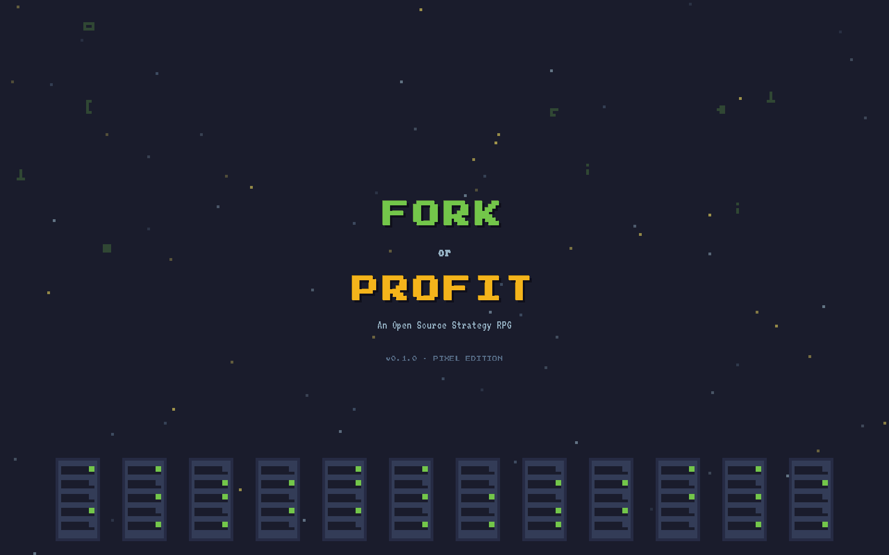
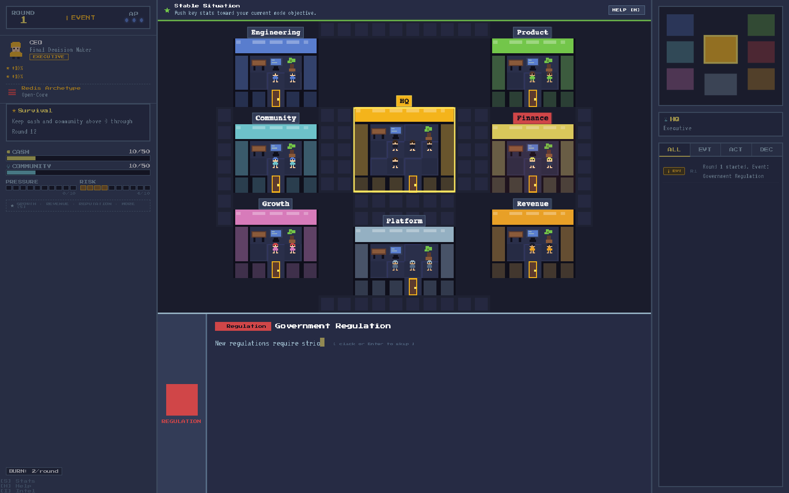

# Fork or Profit

<a href="https://www.buymeacoffee.com/pinkbanana" target="_blank"></a>

Open-source or profit? **Fork or Profit** is a pixel-style strategy RPG/card game about running a tech company under constant trade-offs.

- English
- [中文](./README.zh-CN.md)

## Play Online

- [Cloudflare Workers Deployment](https://fork-or-profit.evilbanana.workers.dev)

## Screenshots

### Title Screen



### In-Game Screen



## Core Experience

You pick a role, choose a company archetype, and chase a victory condition while managing conflicting company metrics.

Each round follows a clear loop:

1. **Event phase**: respond to a narrative event with strategic choices.
2. **Action phase**: spend Action Points to play cards.
3. **Resolution phase**: apply effects, update stats, and check win/lose conditions.

Primary stats include:
`cash`, `revenue`, `community`, `growth`, `reputation`, `control`, `dev_speed`, `stability`, `pressure`, `trust`, `risk`.

## Game Modes

- **Survival**: keep cash and community above 0 through Round 12.
- **IPO**: reach revenue >= 30 and reputation >= 15 by Round 20.
- **OSS Legend**: reach community >= 30 and growth >= 20 by Round 20.
- **Acquisition Exit**: trigger an acquisition event and satisfy reputation + revenue >= 25.
- **Open-Core**: reach both community >= 15 and revenue >= 15 by Round 20.

## Controls

- `Tab`: switch setup panel focus.
- `Arrow Left / Right`: change role, company, or mode in setup.
- `Arrow Up / Down`: choose event options.
- `1-9`: quick-play cards in action phase.
- `Enter`: confirm current option or card.
- `E`: end action turn.
- `S`: toggle detailed status panel.
- `H`: open help overlay.
- `I`: open Intel panel.
- `Esc`: close overlays.

## Local Development

### Prerequisites

- Node.js 20+
- `pnpm`

### Run Locally

```bash
pnpm install
pnpm run dev
```

Open `http://localhost:5173`.

### Build

```bash
pnpm run build
```

### Deploy to Cloudflare

```bash
pnpm run deploy
```

## Cloudflare Bindings (D1 + KV)

Update `wrangler.jsonc` with your real IDs for:

- `d1_databases`
- `kv_namespaces`

Generate typed bindings after Wrangler is configured:

```bash
pnpm run cf-typegen
```

## Design Docs

- [design/overview.md](./design/overview.md)
- [design/roles.md](./design/roles.md)
- [design/organization.md](./design/organization.md)
- [design/industry-and-domain.md](./design/industry-and-domain.md)
- [design/strategy-cards.md](./design/strategy-cards.md)
- [design/events.md](./design/events.md)
- [design/company-archetypes.md](./design/company-archetypes.md)

## License

MIT. See [LICENSE](./LICENSE).
